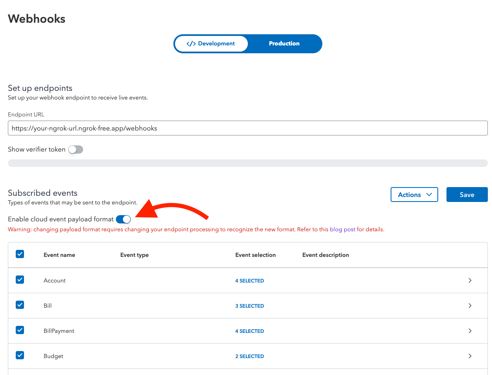

[][ss1][][ss2][][ss3]

# QuickBooks CloudEvents Webhooks Sample App (Java)

**Pure SDK 6.5.2 webhook integration with real-time CloudEvents dashboard**

This sample application demonstrates QuickBooks **CloudEvents v1.0** webhook implementation using **Java SDK 6.5.2** with **Java 17 + Spring Boot 3.3.5** 

## Features

- **Pure SDK Implementation** - Uses SDK 6.5.2
- **CloudEvents v1.0 Format** - Native support for the new webhook standard
- **Real-time Dashboard** - View webhook events with formatted JSON payload
- **Signature Validation** - Secure webhook verification using SDK methods
- **OAuth 2.0 Flow** - Session-based authentication (no database required)
- **Auto-refresh** - Dashboard updates every 30 seconds
- **Portal Testing** - Test webhooks using QuickBooks Developer Portal's "Send test event" feature

## CloudEvents Format

QuickBooks webhooks now use the CloudEvents v1.0 specification. Each webhook event includes:

```json
[
  {
    "specversion": "1.0",
    "id": "88cd52aa-33b6-4351-9aa4-47572edbd068",
    "source": "intuit.dsnBgbseACLLRZNxo2dfc4evmEJdxde58xeeYcZliOU=",
    "type": "qbo.customer.created.v1",
    "datacontenttype": "application/json",
    "time": "2025-09-10T21:31:25.179Z",
    "intuitentityid": "1234",
    "intuitaccountid": "310687",
    "data": {}
  }
]
```

**Key Fields:**
- `type` - Entity and event (e.g., `qbo.customer.created.v1`)
- `intuitentityid` - The entity ID that changed
- `intuitaccountid` - QuickBooks company realm ID
- `time` - ISO 8601 timestamp of the event

## Table of Contents

* [Requirements](#requirements)
* [First Use Instructions](#first-use-instructions)
* [Running the code](#running-the-code)
* [Configuring the endpoint](#configuring-the-endpoint)
* [Project Structure](#project-structure)
* [Reset the App](#reset-the-app)


## Requirements

- **Java 17+** (JDK 17 or higher)
- **Gradle 8.x** (wrapper included)
- **[developer.intuit.com](http://developer.intuit.com) account**
- **QuickBooks app** with OAuth 2.0 credentials and **CloudEvents webhooks enabled**
- **ngrok** or similar tool to expose localhost
- **QuickBooks Sandbox company** (or production)

**Note:** Make sure to enable CloudEvents format in your QuickBooks developer portal webhook settings!

## Important: CloudEvents Payload Format

When you enable **CloudEvents payload format** in the QuickBooks developer portal, you'll see a warning:

> "Warning: changing payload format requires changing your endpoint processing to recognize the new format."

**This sample app is already configured for CloudEvents!** Here's what changed:

### Payload Structure Differences

**CloudEvents Format (This App):**
```json
[{
  "specversion": "1.0",
  "type": "qbo.customer.created.v1",
  "intuitentityid": "123",
  "intuitaccountid": "9341455327810551"
}]
```


## Quick Start

### 1. Clone and Setup

```bash
git clone <repository-url>
cd SampleApp-Webhooks-Java
```

### 2. Configure Environment Variables

Copy `.env.example` to `.env` and fill in your QuickBooks app credentials:

```bash
cp .env.example .env
```

Edit `.env` with your values:

```env
QB_CLIENT_ID=your_client_id_from_developer_intuit_com
QB_CLIENT_SECRET=your_client_secret_from_developer_intuit_com
QB_REDIRECT_URI=https://your-ngrok-url.ngrok-free.app/callback
QB_ENVIRONMENT=sandbox
WEBHOOKS_VERIFIER_TOKEN=your_webhook_verifier_token
```

**Security Note:** Never commit your `.env` file! It's already in `.gitignore`.

### 3. Set Up ngrok

**ngrok** exposes your localhost to the internet so QuickBooks can send webhooks to your local development environment.

**Note:** This sample app is designed for ngrok. While other tunneling services may work, ngrok is recommended and tested for this application.

**Install ngrok:**
- Visit [ngrok.com](https://ngrok.com/) and sign up for a free account
- Download and install ngrok for your platform
- Follow the [ngrok setup instructions](https://ngrok.com/docs/getting-started/) to authenticate

**Start ngrok:**
```bash
ngrok http 8080
```

Copy the HTTPS URL (e.g., `https://abc123.ngrok-free.app`) and:
- Add `/callback` to it for `QB_REDIRECT_URI` in your `.env`
- Add `/webhooks` to it for your webhook endpoint in QuickBooks developer portal

**Important:** Keep ngrok running in a separate terminal while testing webhooks!

### 4. Configure QuickBooks App


*Configure your QuickBooks app with OAuth credentials and webhook settings in the developer portal.*

**Login to developer portal:**
1. Go to [developer.intuit.com](https://developer.intuit.com) and **sign in** to your developer account
2. Navigate to your app dashboard: [https://developer.intuit.com/app/developer/dashboard](https://developer.intuit.com/app/developer/dashboard)
3. Select your app (or create a new one if you don't have one)

**Configure Keys & OAuth:**
1. Click on **Keys & OAuth** in the left sidebar
2. Add redirect URI: `https://your-ngrok-url.ngrok-free.app/callback`
3. Copy your **Client ID** and **Client Secret** to your `.env` file

**Configure Webhooks:**
1. Click on **Webhooks** in the left sidebar  
2. Add webhook endpoint: `https://your-ngrok-url.ngrok-free.app/webhooks`
3. Subscribe to entities: `Customer`, `Vendor`, `Invoice`, `Payment`
4. Copy your **Verifier Token** to your `.env` file
5. **Enable CloudEvents payload format** (you'll see a warning - this app is already configured for it!)

### 5. Run the App

**IMPORTANT:** Run this command in a **separate terminal window** (keep ngrok running in the first terminal):

```bash
./gradlew bootRun
```

Wait for the message: `Started Application in X.XXX seconds`

Then open http://localhost:8080 and click "Connect to QuickBooks"

## Application Walkthrough

### Video Demo

[https://github.intuit.com/noneal/SampleApp-Webhooks-Java-CloudEvents/assets/86120/4ce381e7-f648-4529-9f8a-d98a9de8573d](https://github.com/user-attachments/assets/87ee7cc8-2c20-48c0-ac11-2d04972afc82)

Watch the complete application walkthrough above showing OAuth connection, webhook configuration, and real-time event monitoring.

### Application Steps

1. **Launch Page** - The home page displays the main features and a "Connect to QuickBooks" button to begin OAuth authentication.

2. **OAuth Authorization** - Click "Connect to QuickBooks" and select your QuickBooks Sandbox company to authorize the application to receive webhooks.

3. **Configure Webhook Settings in Developer Portal** - Navigate to your app in the QuickBooks Developer Portal, configure your webhook endpoint URL and verifier token, then enable CloudEvents format. Click "Send test event" to test your webhook endpoint and verify it can receive CloudEvents notifications.

4. **Dashboard Overview** - After connecting, the dashboard displays your connection information, webhook URL endpoint, and recent webhook events.

5. **View Webhook Details** - Click "View Details" on any webhook event to see CloudEvents metadata, Entity ID, Account ID, and the formatted JSON payload showing the complete CloudEvents structure.

## Running the code

Once the sample app code is on your computer, you can do the following steps to run the app:

1. cd to the project directory</li>
2. Run the command:`./gradlew bootRun` (Mac OS) or `gradlew.bat bootRun` (Windows)</li>
3. Wait until the terminal output displays the "Started Application in xxx seconds" message.
4. Open your browser and go to http://localhost:8080/companyConfigs - This will list the companies in the repository for which you have subscribed event notification.
5. The webhooks endpoint in the sample app is http://localhost:8080/webhooks
6. Once an event notification is received and processed, you can perform step 4 to see that the last updated timestamp has been updated for the realmId for which notification was received.
7. To run the code on a different port, uncomment and update server.port property in application.properties

## Configuring the endpoint

Webhooks requires your endpoint to be exposed over the internet. The easiest way to do that while you are still developing your code locally is to use [ngrok](https://ngrok.com/).

### ngrok Setup Instructions

1. **Sign up and install**: Visit [ngrok.com](https://ngrok.com/) to create a free account and download ngrok
2. **Authenticate**: Follow [ngrok's setup guide](https://ngrok.com/docs/getting-started/) to connect your account
3. **Expose your localhost** by running this command in a terminal:
   ```bash
   ./ngrok http 8080
   ```
4. You will get a forwarding URL that looks like this:
   ```
   Forwarding     https://cb063e9f.ngrok.io -> localhost:8080
   ```
   **Important:** Use only the **HTTPS** URL, not HTTP, for webhooks!
   
5. Your webhook endpoint URL will be: `https://cb063e9f.ngrok.io/webhooks`
6. Copy this URL and configure it in your QuickBooks app on [developer.intuit.com](https://developer.intuit.com/app/developer/dashboard)

### Testing Webhooks

This app processes **CloudEvents v1.0** format webhooks from QuickBooks:

```json
[
  {
    "specversion": "1.0",
    "id": "88cd52aa-33b6-4351-9aa4-47572edbd068",
    "type": "qbo.customer.created.v1",
    "time": "2025-09-10T21:31:25.179Z",
    "intuitentityid": "1",
    "intuitaccountid": "123456789",
    "data": {}
  }
]
```

**CloudEvents Features:**
- **type** field (e.g., `qbo.customer.created.v1`) encodes entity and operation
- **intuitentityid** contains the entity ID
- **intuitaccountid** contains the realm ID (company ID)
- Standards-compliant [CloudEvents v1.0](https://cloudevents.io/) specification

**How It Works:**
- QuickBooks sends webhook to your `/webhooks` endpoint
- Signature verified using `intuit-signature` header (HMAC-SHA256)
- App parses CloudEvents format using SDK's `WebhooksCloudEvents` class
- Events stored in memory for dashboard display 

## Key Components

### Webhook Reception
- Receives CloudEvents v1.0 webhooks from QuickBooks
- Validates webhook signatures using SDK's `WebhooksService`
- Parses events using SDK's `WebhooksCloudEvents` class
- Stores events in memory for dashboard display

### Real-Time Dashboard
- View recent webhook events with auto-refresh (30s)
- Expandable event details showing all CloudEvents fields
- Formatted JSON payload display
- Clean, modern UI built with Thymeleaf

### OAuth 2.0 Authentication
- Secure OAuth flow using QuickBooks Java SDK
- Session-based token storage (no database required)
- Automatic token refresh handling
- Sandbox and production environment support

## Project Structure

```
src/main/java/
  config/
    QuickBooksConfig.java          # App configuration & OAuth settings
    EnvConfig.java                 # .env file loader
  controllers/
    WebhooksViewController.java     # Main dashboard controller
    WebhooksController.java         # Webhook receiver endpoint
  service/
    CloudEventsWebhookParser.java   # CloudEvents parser using SDK
    QuickBooksOAuthService.java     # OAuth 2.0 flow
    WebhookStorageService.java      # In-memory webhook storage
    security/
      SecurityService.java          # Webhook signature validation
      WebhooksServiceFactory.java   # SDK WebhooksService factory
  domain/
    ResponseWrapper.java            # API response model

src/main/resources/
  application.yml                   # Main configuration
  templates/
    index.html                      # Home page
    dashboard.html                  # Webhooks dashboard
```

* Property files are located in the [`src.main.resources`](src/main/resources) directory
* JUnit test files are located in the [`src.test.java`](src/test/java) directory

## Architecture

### Webhook Flow

```
1. QuickBooks -> Webhook Notification (CloudEvents v1.0) -> /webhooks endpoint
2. WebhooksController -> Validates signature using SDK WebhooksService
3. CloudEventsWebhookParser -> Parses using SDK WebhooksCloudEvents class
4. WebhookStorageService -> Stores events in memory (List)
5. Dashboard -> Displays webhook events with auto-refresh
```

### Storage

- **In-Memory Storage** - Webhooks stored in Java `ConcurrentHashMap`
- No database required
- Data persists during runtime only
- **Note:** Webhook history is cleared on app restart

### Configuration

**Environment-based:**
- OAuth credentials from `.env` file
- Webhook verifier token from `.env`
- Configuration loaded via `EnvConfig` class
- No secrets committed to git

## Development

### Running Tests

```bash
./gradlew test
```

### Building

```bash
./gradlew clean build
```

### Hot Reload

Thymeleaf templates reload automatically in dev mode.

## Troubleshooting

### Webhooks Received in Terminal But Not Showing in Dashboard

If you see webhooks in your terminal logs but they don't appear in the dashboard UI, this is typically caused by accessing the app from a different URL than the one configured for OAuth.

**Solution:** Access the app using your ngrok URL instead of localhost:8080. OAuth session cookies are domain-specific and won't work across different URLs.

**Note on Other Tunneling Services:** This sample app is tested with ngrok. Other tunneling services may not properly forward session cookies, which can cause webhooks to be received but not displayed in the UI.

### Webhooks Not Arriving / Dashboard Count Not Updating

**This is a common issue!** Here's what to check:

1. **Signature Validation** - The app validates webhook signatures for security
   - Webhooks from third-party testing sites (not QuickBooks) will be **REJECTED** unless they include a valid signature
   - The signature must be created using your `WEBHOOKS_VERIFIER_TOKEN`
   - Check your application logs for `"Webhook signature validation failed"` messages
   
2. **Dashboard Smart Refresh** - The dashboard automatically refreshes every 30 seconds
   - Refresh is smart: it won't reload if you have modals or webhook details open
   - Wait up to 30 seconds after sending a webhook to see the count update
   - Or manually refresh your browser to see updates immediately
   
3. **Using ngrok vs Other Testing Tools:**
   - **ngrok is REQUIRED** for proper webhook testing with QuickBooks
   - Other webhook testing sites (e.g., webhook.site, requestbin) will NOT work because:
     - They don't provide valid QuickBooks signatures
     - The app will reject unsigned or improperly signed webhooks (returns 403 Forbidden)
   - To test webhooks properly:
     - Use ngrok to expose your local server
     - Configure the ngrok URL in QuickBooks developer portal
     - Create test entities in QuickBooks (via the dashboard or QuickBooks UI)
     - QuickBooks will send properly signed webhooks to your ngrok URL

4. **Check Application Logs:**
   ```bash
   # Look for these messages in your terminal:
   "Webhook request received"           # ✓ Webhook reached your app
   "Webhook signature validated"        # ✓ Signature is valid
   "Stored webhook event"               # ✓ Webhook was stored
   "Webhook signature validation failed" # ✗ Invalid signature - webhook rejected
   ```

5. **Verify ngrok Configuration:**
   - Ensure ngrok is running and URL matches your `.env` configuration
   - Check that the webhook endpoint in QuickBooks portal matches your ngrok URL + `/webhooks`
   - Verify the verifier token in your `.env` matches the one in QuickBooks portal

### OAuth Connection Fails
1. Verify client ID and secret are correct
2. Check redirect URI matches exactly (including https://)
3. Ensure ngrok URL hasn't changed
4. Clear browser cookies and try again

## Production Considerations

**WARNING: This is a demo app. For production:**

1. **Use a real database** (PostgreSQL, MySQL, etc.)
2. **Implement proper security**:
   - Strong encryption keys
   - HTTPS everywhere
   - CSRF protection
   - Input validation
3. **Add error handling**:
   - Retry logic
   - Dead letter queues
   - Circuit breakers
4. **Scale considerations**:
   - Async processing
   - Rate limiting
   - Caching
5. **Monitoring**:
   - Application metrics
   - Error tracking
   - Performance monitoring

## License

This project is licensed under the **Apache License 2.0** - see the [LICENSE](LICENSE) file for details.

Copyright 2016 Intuit, Inc.

Licensed under the Apache License, Version 2.0 (the "License"); you may not use this file except in compliance with the License. You may obtain a copy of the License at:

http://www.apache.org/licenses/LICENSE-2.0

Unless required by applicable law or agreed to in writing, software distributed under the License is distributed on an "AS IS" BASIS, WITHOUT WARRANTIES OR CONDITIONS OF ANY KIND, either express or implied. See the License for the specific language governing permissions and limitations under the License.

## Support

- [QuickBooks API Documentation](https://developer.intuit.com/app/developer/qbo/docs/get-started)
- [Webhooks Guide](https://developer.intuit.com/app/developer/qbo/docs/develop/webhooks)
- [Developer Forums](https://help.developer.intuit.com/s/)

[ss1]: #
[ss2]: https://customersurveys.intuit.com/jfe/form/SV_9LWgJBcyy3NAwHc?check=Yes&checkpoint=SampleApp-Webhooks-Java&pageUrl=github
[ss3]: https://customersurveys.intuit.com/jfe/form/SV_9LWgJBcyy3NAwHc?check=No&checkpoint=SampleApp-Webhooks-Java&pageUrl=github
